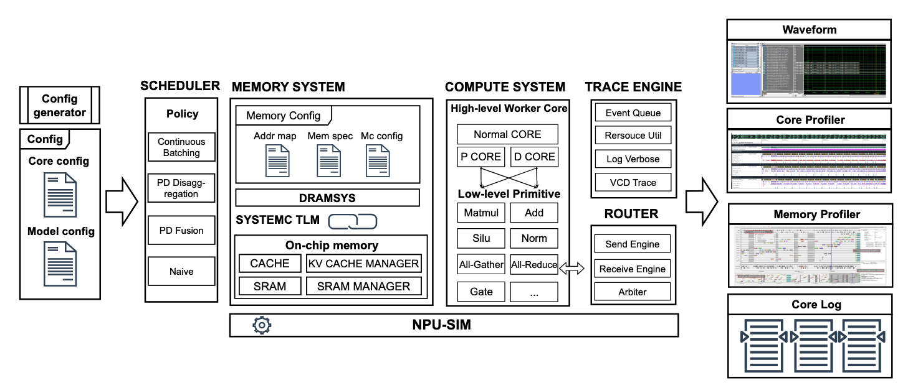

# NPU-SIM

NPU-SIM 是一款面向多核 NPU（Neural Processing Unit，神经处理器）的轻量级、面向大规模、分层次的仿真框架。它同时支持事务级（TLM）与基于性能模型的仿真，为大规模模型（如大语言模型 LLM）提供强大的系统级分析能力。

该框架具有高度的灵活性与可扩展性，支持对多种硬件与模型配置进行细粒度仿真。其关键特性包括：

* **灵活的并行性**：探索多种张量并行策略。
* **可定制的核心布置**：支持用户自定义核心布置策略。
* **先进的内存管理**：仿真多样化的内存管理方法。
* **可配置的数据流**：在多核 NPU 上可在 PD-disaggregation 与 PD-fusion 之间进行选择。

此外，NPU-SIM 通过支持晶圆级（wafer-scale）仿真扩展了其能力，可用于分析采用混合键合与分布式内存架构的系统。



更多详情请访问 [NPU-SIM 文档](https://npu-sim.readthedocs.io/zh-cn/latest/)。


## 使用 NPU-SIM

### 1. 依赖项

- OS: Linux

- SystemC: 2.3.3

- CMake: 3.31.3

- G++: 9.4.0


### 1.1 安装 SystemC

```bash
wget https://github.com/accellera-official/systemc/archive/refs/tags/2.3.3.tar.gz
tar -zxvf 2.3.3.tar.gz
cd systemc-2.3.3/
mkdir tmp && cd tmp
../configure --prefix=/path/to/install/systemc-2.3.3 CXXFLAGS="-std=c++17"
sudo make -j8
make install
```

在 `~/.bashrc` 文件中追加：

```bash
export SYSTEMC_HOME=/path/to/install/systemc-2.3.3/
export LD_LIBRARY_PATH=/path/to/install/systemc-2.3.3/lib-linux64/:$LD_LIBRARY_PATH
```

### 1.2 安装 CMake 3.31.3
```bash
# 从官网 https://cmake.org/download/ 下载对应源码或二进制包
wget https://cmake.org/files/v3.31/cmake-3.31.3-linux-x86_64.tar.gz
tar -zxvf cmake-3.31.3-linux-x86_64.tar.gz
```

### 1.3 安装 JSON 库

```bash
git clone --branch=v3.11.3 --single-branch --depth=1 https://github.com/nlohmann/json.git
cd json
mkdir build && cd build
cmake ..
make
sudo make install
```

### 1.4 安装多媒体库

```bash
# 安装 SFML
sudo apt-get install libsfml-dev

# 安装 CAIRO
sudo apt install libcairo2-dev

# 安装 X11（服务器环境可能需要）
sudo apt install xorg

# 安装字体（源文件已包含必要的 ttf 文件）
sudo apt install ttf-mscorefonts-installer  # 需要在弹出界面选择 OK
```

### 2. 编译与运行

```bash
cd /path/to/NPU-SIM/src
mkdir build && cd build
cmake ..
make -j8
```

```bash
./train_gpt2 --config-file /path/to/NPU-SIM/src/llm/test/config_gpt2_small_tp_24_new.json --use-dramsys true
```
